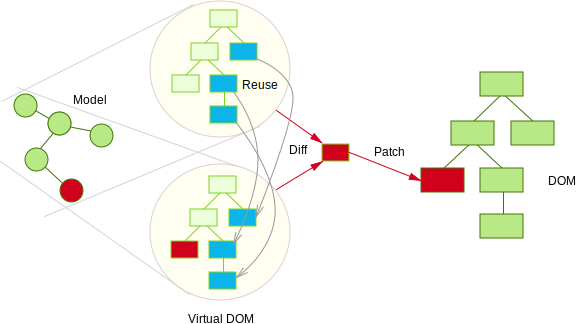

- title : Gentle Introduction to FP with F#
- theme : night
- transition : default

***

## Gentle Introduction to FP with F#

 
 

### Where

[@ 'fun' is a key word](http://www.twitter.com/sforkmann)

***

### Quick Agenda

* Intro
    * C# 7 features
    * Your voice
* After Intro
    * C# is not enough? 
    * WTFunctional programing is?
    * Why The F#
* Real Intro
    * REPL, F#, etc
* Real Intro 2
    * Simple problem in F#
    * Simple problem in F# continued

---

## Quick Agenda 2
* Myths
    * Negative
    * Positive
    * Misc
* Voting Results
* Javascript (will) rules

***

## C# 7 Features

* Out variables
* Tuples and deconstruction
* Pattern matching
* Local functions
* Expanded expression bodied members
* Ref locals and returns

 
Taken from [@History of C#](https://docs.microsoft.com/en-us/dotnet/csharp/whats-new/csharp-version-history)
 
 

---

## C# 7 Features Presented by

<section id="fragments">
    
    
Who mostly abused them 
    
    
</section>

***

## But before we talk about C#7 fearures

<section id="fragments31">
     
     
         
        
</section>

 

***

## Which C# features are most important?

###Go to [@http://cspollapp.azurewebsites.net](http://cspollapp.azurewebsites.net)

* anonymity guranteed
* results will prove nothing - just out of curiosity
* take your time
* order of choices matter
* All written in F#?

***

    

***

## ...C# 7 Features

* Out variables
* Tuples and deconstruction
* Pattern matching
* Local functions
* Expanded expression bodied members
* Ref locals and returns

 

 
 
 

---

### At least two of these features are idiomatic for many functional languages

* Pattern matching
* Tuples and deconstruction

---

### Other two aim to increase expressiveness

* Out variables
* Expanded expression bodied members

---

## C# is getting more expressive and functional? It seems so

---

## Then why bother learn other language, even more functional one, at all?

---

### What is functional anyway?

---

###A (very) basic definition:
 
<section id="fragments2">
     
     
    
A style of programming where the basic method of 
    computation is application of functions to arguments. 

</section>

***

## Basic definition continued
### What is a function?
<section id="arguments23">    
             
          
    
    
 A relation from a set X to a set Y where each element of X is related to exactly one element in Y

</section>

***

## Examples

* Function: { (1,d) , (2,d) , (3, a) }
* Not a Function: { (1,a) , (2, b) , (2, c) , (3, d) } - **c is related to 2 elems**

***

## Function properties

- same output for same input
- result depends only input. Input is not changed 
- In fact, nothing outside of the functon is changed( No side effects) 
- Has exacly one input and one output
    
***

### Other basic definitions

####A style of programming where the basic method of computation is application of functions to arguments.

<section id="fragments11">
     
     
    

                                                               
        Do we know other styles?
    

    
        
         
        
For Example: 

        
Style of programming where the basic method of computation is changing of state
        through statements
        

    

    

         
         
        <h3>AKA Imperative programming</h3>
    

</section>

***

### Too much state mutation and too much statements are what functional languages try to avoid

<section id="fragments3">    
    

         
         
        OO Languages just happen to have a lot of them.
    

</section>

***

### Anyway, many OO Languages have some support for functions. Why not use them to learn FP?
<section id="fragments4">        
    <ul>
        <li class="fragment">It is harder to write in functional style</li>
        <ul class="fragment">
            <li class="fragment">Functions always put in classes</li>        
            <li class="fragment">Functions are not allowed everywhere (aka not first-class)</li>        
            <li class="fragment">No partial application, currying, composition by default</li>        
            <li class="fragment">Limited support for higher order functions (not so in C#, JS) </li>
        </ul>
        <li class="fragment"> New functional features are not natural or are incomplete</li>
        <li class="fragment">Solutions to many common tasks are not functional (just open SO)</li>    
        <li class="fragment">OO Languages are taught in imperative style </li>    
        <ul class="fragment">
            <li class="fragment">Switch, if-else, for, while, mutation through asignment</li>       
        </ul>
    </ul> 
</section>

***

### If not using OO Lnaguages, why learn FP through so different language?
<section id="fragments5">
        
     
       
    
Thinking about problems in new ways. Different approach, different view of the world (not better, but different)

</section>

***
## Why F#

***

### My Personal (AKA subjective) arguments

<section class="fragments6">
<ul>
    <li class="fragment">have read/heard that F# is used in competitive industry as finance, where tooling can give edge</li>
    <li class="fragment">A friend of mine, who is PhD in CS, speaks with great love of F#</li>
    <li class="fragment">I liked how simple some things are with javascript/jquery/lodash, and especially liked the lodash higher order functions</li>
    <li class="fragment">I disliked how every class that I`ve seen eventually becomes uncoherent bag of methods (It looked to me as a module( from the JS module pattern))</li>
</ul>
</section>

***
### "Techical" (AKA subjective) arguments

<section class="fragments7">
<ul>
    <li class="fragment">I wanted the language to be used in some industry ( opposed to research languages) and be somewhat mature(Lisp family(Closure, Scheme, LISP), Scala, Haskell, FSharp, Ocaml, Erlang)</li>
    <li class="fragment">I did not like LISP family syntax (Scala, Haskell, FSharp, Ocaml, Erlang)</li>
    <li class="fragment">I was afraid that diving into pure FP might be to much effort (Scala, FSharp, Ocaml, Erlang)</li>
    <li class="fragment">WTFunctional Camels have to do will programming (Scala, FSharp, Erlang)</li>
    <li class="fragment">I wanted to have language that is used on a popular platform, where a lot libraries exist(Scala, FSharp)</li>
    <li class="fragment">I preffered F# due to familiarity with platform</li>
</ul>
</section>

***
## F#FTW
<section class="fragments7">
<ul>
    <li class="fragment">mature...</li>
    <li class="fragment">...functional-first...</li>
    <li class="fragment">...cross-platform...</li>
    <li class="fragment">...open-source...</li>
    <li class="fragment">...implementation of Ocaml on .Net</li>
</ul>
</section>

***

 
 

***
##F#FTW (More features)

<section class="fragments7">
<ul>
    <li class="fragment">statically typed...</li>
    <li class="fragment">...with type inference...</li>
    <li class="fragment">...immutable by default...</li>
    <li class="fragment">...exression oriented...</li>
    <li class="fragment">...compatible with other .NET languages</li>
</ul>
</section>

***

## Simple problem(Demo)

***

## Simple problem continued... (Demo)

***

## Can we do "better"? (Demo)

***

#### "Elm - Architecture"

 

 <small>http://danielbachler.de/2016/02/11/berlinjs-talk-about-elm.html</small>

--- 

### Model - View - Update

    // MODEL

    type Model = int

    type Msg =
    | Increment
    | Decrement

    let init() : Model = 0

---

### Model - View - Update

    // VIEW

    let view model dispatch =
        div []
            [ button [ OnClick (fun _ -> dispatch Decrement) ] [ str "-" ]
              div [] [ str (model.ToString()) ]
              button [ OnClick (fun _ -> dispatch Increment) ] [ str "+" ] ]

---

### Model - View - Update

    // UPDATE

    let update (msg:Msg) (model:Model) =
        match msg with
        | Increment -> model + 1
        | Decrement -> model - 1

---

### Model - View - Update

    // wiring things up

    Program.mkSimple init update view
    |> Program.withConsoleTrace
    |> Program.withReact "elmish-app"
    |> Program.run

---

### Model - View - Update

# Demo

***

### Sub-Components

    // MODEL

    type Model = {
        Counters : Counter.Model list
    }

    type Msg = 
    | Insert
    | Remove
    | Modify of int * Counter.Msg

    let init() : Model =
        { Counters = [] }

---

### Sub-Components

    // VIEW

    let view model dispatch =
        let counterDispatch i msg = dispatch (Modify (i, msg))

        let counters =
            model.Counters
            |> List.mapi (fun i c -> Counter.view c (counterDispatch i)) 
        
        div [] [ 
            yield button [ OnClick (fun _ -> dispatch Remove) ] [  str "Remove" ]
            yield button [ OnClick (fun _ -> dispatch Insert) ] [ str "Add" ] 
            yield! counters ]

---

### Sub-Components

    // UPDATE

    let update (msg:Msg) (model:Model) =
        match msg with
        | Insert ->
            { Counters = Counter.init() :: model.Counters }
        | Remove ->
            { Counters = 
                match model.Counters with
                | [] -> []
                | x :: rest -> rest }
        | Modify (id, counterMsg) ->
            { Counters =
                model.Counters
                |> List.mapi (fun i counterModel -> 
                    if i = id then
                        Counter.update counterMsg counterModel
                    else
                        counterModel) }

---

### Sub-Components

# Demo

***

### React

* Facebook library for UI 
* <code>state => view</code>
* Virtual DOM

---

### Virtual DOM - Initial

 
 

 

 
 

 <small>http://teropa.info/blog/2015/03/02/change-and-its-detection-in-javascript-frameworks.html</small>

---

### Virtual DOM - Change

 
 

 

 
 

 <small>http://teropa.info/blog/2015/03/02/change-and-its-detection-in-javascript-frameworks.html</small>

---

### Virtual DOM - Reuse

 
 

 

 
 

 <small>http://teropa.info/blog/2015/03/02/change-and-its-detection-in-javascript-frameworks.html</small>

*** 

### ReactNative

 

 <small>http://timbuckley.github.io/react-native-presentation</small>

***

### Show me the code

*** 

### TakeAways

* Learn all the FP you can!
* Simple modular design

*** 

### Thank you!

* https://github.com/fable-compiler/fable-elmish
* https://ionide.io
* https://facebook.github.io/react-native/
